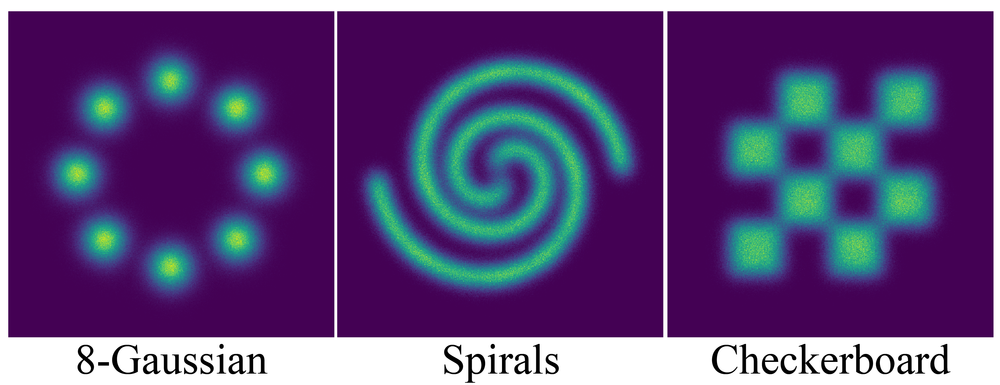

# Two-Dimensional Examples
This folder contains the code implementation of the two-dimensional experiments in Section 3.2 of the paper [*On Investigating the Conservative Property of Score-Based Generative Models*](https://arxiv.org/abs/2209.12753).



## Usage
Train and evaluate models using the command with the following format.
```
python main.py --mode {$(1)} --workdir {$(2)} --config {$(3)}
```
- (1) `mode`: is set as `train` or `eval` for training or evaluation.
- (2) `workdir`: the directory created for saving the experimental results such as visualized examples and checkpoints.
- (3) `config`: the configuration file that specifies the hyper-parameters.

### Examples of Training Commands
- Train a constrained score-based model (CSBM)
```
python3 main.py --workdir checkerboard_csbm --mode train --config configs/csbm/checkerboard_config.py
```

- Train an unconstrained score-based model (USBM)
```
python3 main.py --workdir checkerboard_usbm --mode train --config configs/usbm/checkerboard_config.py
```

- Train a quasi-conservative score-based model (QCSBM)
```
python3 main.py --workdir checkerboard_qcsbm --mode train --config configs/qcsbm/checkerboard_config.py
```

### Examples of Evaluation Commands
- Evaluate the negative log likelihood (NLL)
```
python3 main.py --workdir checkerboard_qcsbm --mode eval --type nll --config configs/qcsbm/checkerboard_config.py --restore results/checkerboard_qcsbm/checkpoints/checkpoint_4000.pth
```

- Evaluate the score errors
```
python3 main.py --workdir checkerboard_qcsbm --mode eval --type score_err --config configs/qcsbm/checkerboard_config.py --restore results/checkerboard_qcsbm/checkpoints/checkpoint_4000.pth
```

- Evaluate the sampling performance
```
python3 main.py --workdir checkerboard_qcsbm --mode eval --type sampling --config configs/qcsbm/checkerboard_config.py --restore results/checkerboard_qcsbm/checkpoints/checkpoint_4000.pth
```