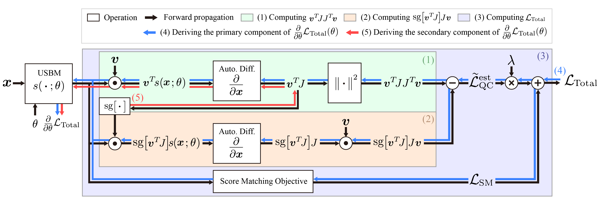

# On Investigating the Conservative Property of Score-Based Generative Models
[](https://arxiv.org/abs/2209.12753)
[](https://youtu.be/8JpeVbwRcyM)

This repository contains the code implementation of the experiments presented in the paper [*On Investigating the Conservative Property of Score-Based Generative Models*](https://arxiv.org/abs/2209.12753).



The project page is available at: <https://chen-hao-chao.github.io/qcsbm/>

## Directory Structure
- Use the code in [qcsbm/gaussian_example](/gaussian_example) to reproduce the experimental results presented in **Section 3.1**.
- Use the code in [qcsbm/2d_examples](/2d_examples) to reproduce the experimental results presented in **Section 3.2**.
- Use the code in [qcsbm/real_world](/real_world) to reproduce the experimental results presented in **Section 5**.
- Use the code in [qcsbm/autoencoder_example](/autoencoder_example) to reproduce the experimental results presented in **Section 6**.

## Dependencies

**(Optional)** Launch a docker container:

```sh
# assume the current directory is the root of this repository
docker run --rm -it --gpus all --ipc=host -v$(pwd):/app nvcr.io/nvidia/pytorch:20.12-py3
# inside the docker container, run:
cd /app
```

Install the necessary Python packages through the following commands:

```
pip install -r requirements.txt --use-feature=2020-resolver
```

## Citing QCSBM
If you find this code useful, please consider citing our paper.
```bib
@inproceedings{chao2023investigating,
      title={On Investigating the Conservative Property of Score-Based Generative Models}, 
      author={Chen-Hao Chao and Wei-Fang Sun and Bo-Wun Cheng and Chun-Yi Lee},
      year={2023},
      booktitle={International Conference on Machine Learning (ICML)},
}
```

## License

To maintain reproducibility, we freezed the following repository and list its license below:
- [yang-song/score_sde_pytorch](https://github.com/yang-song/score_sde_pytorch) (at commit 1618dde) is licensed under the [Apache-2.0 License](https://github.com/yang-song/score_sde_pytorch/blob/main/LICENSE)

Further changes based on the repository above are licensed under the [Apache-2.0 License](LICENSE).
