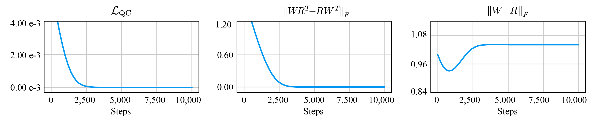

# QCSBM Implemented as a One-Layered Autoencoder
This folder contains the code implementation of the experiment presented in Section 6 of the paper [*On Investigating the Conservative Property of Score-Based Generative Models*](https://arxiv.org/abs/2209.12753).



## Usage

### Training an autoencoder using quasi-conservative regularization term

- Start the training using the following command:
```
python3 main.py --workdir ae_example --config configs/ae_config.py --deterministic --seed 8
```