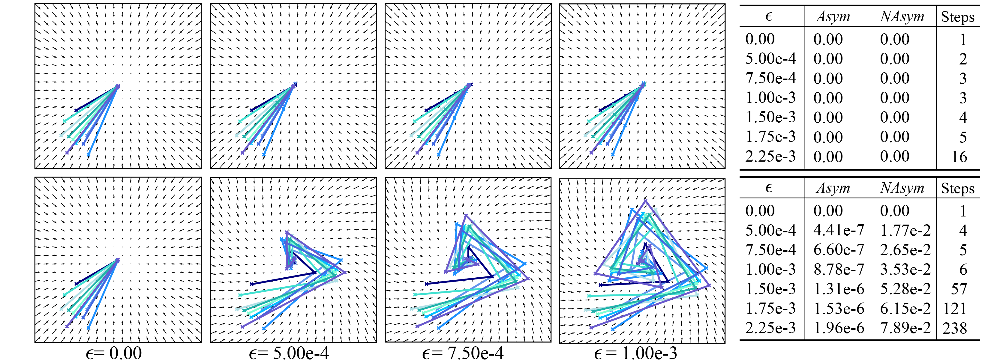

# Sampling Trajectories of USBMs and CSBMs on a Gaussian
This folder contains the code implementation of the experiment presented in Section 3.1 of the paper [*On Investigating the Conservative Property of Score-Based Generative Models*](https://arxiv.org/abs/2209.12753).




## Usage

### Generate Sampling Trajectories using USBMs and CSBMs
- Generate sampling trajectories using a constrained score-based model (CSBM)
```
python3 main.py --workdir csbm_traj --config configs/gaussian_config.py --type csbm --deterministic --seed 0
```

- Generate sampling trajectories using an unconstrained score-based model (USBM)
```
python3 main.py --workdir usbm_traj --config configs/gaussian_config.py --type usbm --deterministic --seed 0
```
