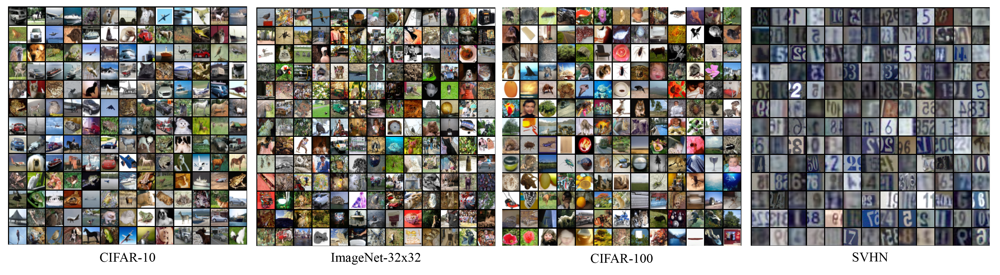

# Experiments on Real-World Datasets
This folder contains the code implementation of the experiments presented in Section 5 of the paper [*On Investigating the Conservative Property of Score-Based Generative Models*](https://arxiv.org/abs/2209.12753).



## Usage

### Training Process
Use the command with the following format to train a QC-NCSN++:
```
python3 main.py --config {$(1)} --balancing_fac {$(2)} --slices {$(3)} --bs {$(4)} --workdir {$(5)} --restore {$(6)}
```
- (1) `config`: training configuration specified in the `configs/training` folder.
- (2) `balancing_fac`: the balancing factor for the quasi-conservative regulerizer.
- (3) `slices`: the number of random vectors used in Hutchinson's trace estimator.
- (4) `bs`: the batch size.
- (5) `workdir`: the directory created for saving the experimental results such as visualized examples and checkpoints.
- (6) `restore`: the path to a checkpoint form which the training process resumes.

#### Examples:
- **(Results in Table 2)** Train a QC-NCSN++ on CIFAR-10 with its balancing factor, number of random vectors, and batch size set to 0.0001, 16, and 8. The training resumes from a pretrained U-NCSN++ at the 600,000-th iteration.
```
python3 main.py --config configs/qc_ncsn/training/cifar10_ncsnpp_deep_continuous.py --balancing_fac 0.0001 --slices 16 --bs 8 --workdir qc_fac=1e-4_bs=8_slice=16 --restore checkpoint.pth
```
- **(Results in Tables 3 and 4)** Train a QC-NCSN++ on CIFAR-10 with its balancing factor, number of random vectors, and batch size set to 0.0001, 1, and 128. The training resumes from a pretrained U-NCSN++ at the 600,000-th iteration.
```
python3 main.py --config configs/qc_ncsn/training/cifar10_ncsnpp_deep_continuous.py --balancing_fac 0.0001 --slices 1 --bs 128 --workdir qc_fac=1e-4_bs=128_slice=1 --restore checkpoint.pth
```

> Please note that the pretrained weights of U-NCSN++ are provided [here](#assets).

### Evaluate the Modeling Ability
- Evaluate NLL and save the results in `workdir`.
```
python3 run_lib_evaluation_nll.py --config configs/qc_ncsn/evaluation/eval_cifar10_config.py --workdir qc_fac=1e-4_bs=8_slice=16 --checkpoint_idx 70 --bs 2500 --calculate 
```
- Read the results of NLL from `workdir`.
```
python3 run_lib_evaluation_nll.py --config configs/qc_ncsn/evaluation/eval_cifar10_config.py --workdir qc_fac=1e-4_bs=8_slice=16 --read 
```
- Evaluate Asym / NAsym and save the results in `workdir`.
```
python3 run_lib_evaluation_asym.py --config configs/qc_ncsn/evaluation/eval_cifar10_config.py --workdir qc_fac=1e-4_bs=8_slice=16  --checkpoint_idx 70 --bs 2500 --calculate 
```
- Read the results of Asym / NAsym from `workdir`.
```
python3 run_lib_evaluation_asym.py --config configs/qc_ncsn/evaluation/eval_cifar10_config.py --workdir qc_fac=1e-4_bs=8_slice=16 --read
```

### Evaluate the Sampling Performance
Use the command with the following format to perform sampling processes:
```
python3 run_lib_sampling.py --config {$(1)} --bs {$(2)} --num_divisions {$(3)} --division_idx {$(4)} --workdir {$(5)}--checkpoint_idx {$(6)}
```
- (1) `config`: evaluation configuration specified in the `configs/evaluation` folder.
- (2) `bs`: the sampling batch size.
- (3) `num_divisions`: the number of threads for simultaneously perform the sampling process.
- (4) `division_idx`: set to a number between [0, num_divisions-1].
- (5) `workdir`: the directory created for saving the sampled data.
- (6) `checkpoint_idx`: the index of the checkpoint adopted for sampling.

#### Examples:
- Perform the sampling process using a QC-NCSN++ trained with 700,000 iterations. The sampling process is divided into 10 sub-processes with each of them using a batch size 2,500. The flag `division_idx` is set to 0 for performing the first sub-process. Make sure that the remaining 1~9 is completed before evaluation.
```
python3 run_lib_sampling.py --config configs/qc_ncsn/evaluation/eval_cifar10_config.py --bs 2500 --num_divisions 10 --division_idx 0 --workdir qc_fac=1e-4_bs=128_slice=1 --checkpoint_idx 70
```
- Perform the sampling process using an ODE sampler by adding the flag `--ode`.
```
python3 run_lib_sampling.py --config configs/qc_ncsn/evaluation/eval_cifar10_config.py --bs 2500 --num_divisions 10 --division_idx 0 --workdir qc_fac=1e-4_bs=128_slice=1 --checkpoint_idx 70 --ode
```

#### Calculate the Sampling Performance Metrics
- Encode the sampled data points using an Inception model for evaluating the sampling performance.
```
python3 run_lib_evaluation_fidis.py --config configs/qc_ncsn/evaluation/eval_cifar10_config.py --workdir qc_fac=1e-4_bs=128_slice=1 --bs 2500 --encode
```
- Calculate FID and IS using the following command:
```
python3 run_lib_evaluation_fidis.py --config configs/qc_ncsn/evaluation/eval_cifar10_config.py --workdir qc_fac=1e-4_bs=128_slice=1 --fidis
```
- Calculate Precision and Recall using the following command:
```
python3 run_lib_evaluation_fidis.py --config configs/qc_ncsn/evaluation/eval_cifar10_config.py --workdir qc_fac=1e-4_bs=128_slice=1 --prdc
```

> Please note that the pre-encoded features of the data samples are provided [here](#assets). Add a flag `--encode_dataset` when performing the encoding command to save the features of the data samples drawn from the datasets.

## Datasets
- **CIFAR-10**

Download CIFAR-10 automatically through the [`tfds` library](https://www.tensorflow.org/datasets/catalog/cifar10) in Tensorflow.

- **CIFAR-100**

Download CIFAR-100 automatically through the [`tfds` library](https://www.tensorflow.org/datasets/catalog/cifar100) in Tensorflow.

- **SVHN**

Download SVHN automatically through the [`tfds` library](https://www.tensorflow.org/datasets/community_catalog/huggingface/svhn) in Tensorflow.

- **ImageNet-32x32**

Download ImageNet-32x32 following the instructions in [here](https://patrykchrabaszcz.github.io/Imagenet32/).

## Assets
| Dataset | Pre-encoded Features | Pre-trained Weights |
| --- | --- | --- |
| CIFAR-10  | [dataset_stat.npz](https://drive.google.com/file/d/1iVdbRrPUXaFOyFHk3dy6QaLjLN7dvcRB/view?usp=sharing) | [u-ncsn++/checkpoint.pth](https://drive.google.com/file/d/1r9fMx_lNGZXAuFXgZAiKfOIZH1mtOQE6/view?usp=sharing) |
| CIFAR-100 | [dataset_stat.npz](https://drive.google.com/file/d/1cUcKBbrGUXdF-ARbJZ4wV5ib2H1ds-_K/view?usp=sharing) | [u-ncsn++/checkpoint.pth](https://drive.google.com/file/d/1r8keN-z_8QgwIpTXfpn1YDxBkeMGI4qA/view?usp=sharing) |
| ImageNet  | [dataset_stat.npz](https://drive.google.com/file/d/12M76PE0QcZsfxMTWIud8gsiCC1NL2tod/view?usp=sharing) | [u-ncsn++/checkpoint.pth](https://drive.google.com/file/d/1GCaqo8GgRtvAAZFBaTyg-mBP4IDqB0I4/view?usp=sharing) |
| SVHN      | [dataset_stat.npz](https://drive.google.com/file/d/1V4ddHVN3PAqGyZV-Vn4m3-LQPO7E2bEh/view?usp=sharing) | [u-ncsn++/checkpoint.pth](https://drive.google.com/file/d/1O4wjiORWwJDCDSv14gB7VMJgzQny0Wc7/view?usp=sharing) |
